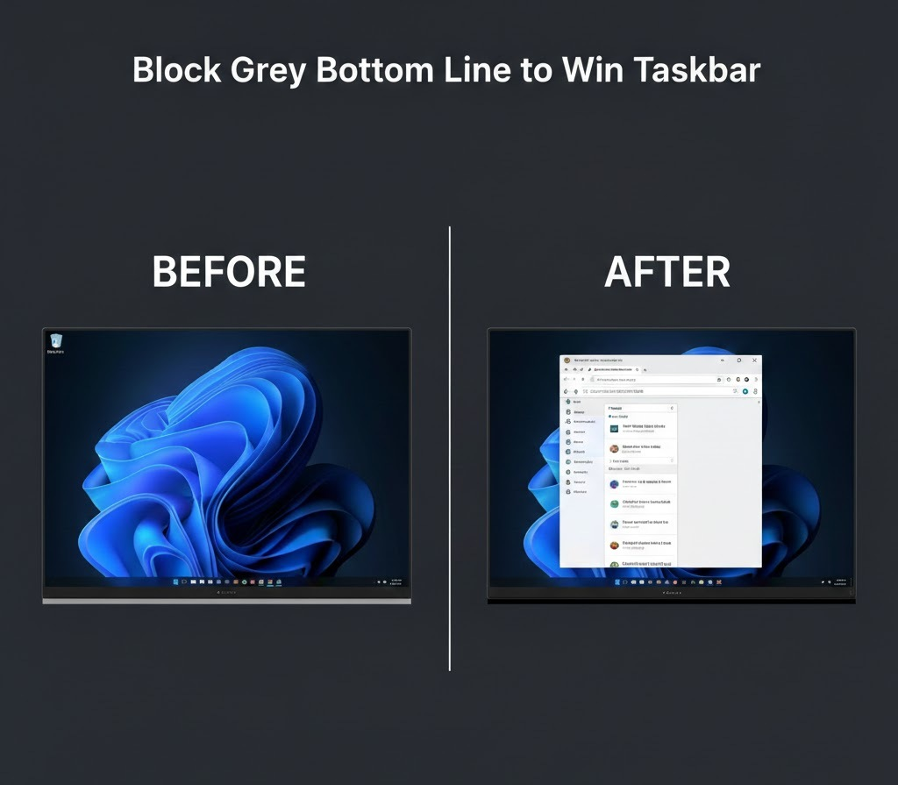

# Block Grey Bottom Line to Win Taskbar

<p align="center">
  
</p>

### The only modern solution for Windows 11's most annoying visual glitch.

If you are a Windows 11 user who loves a clean desktop, you probably use the **"Automatically hide the taskbar"** setting. However, Microsoft leaves a persistent, **2-pixel grey line** (the Presence Indicator) at the bottom of the screen. 

As of **2026**, there is still no official way to remove this. Popular tools like TranslucentTB or registry hacks either fail to hide it or cause system flickering. This tool is specifically designed to fill that gap.

---

## 🌟 Why This Tool?

### **Perfect for OLED Displays**
Static elements are the enemy of OLED panels. That 2px grey line isn't just annoying; it’s a constant static element that breaks pixel uniformity. This tool acts as a **smart digital mask**, ensuring your OLED pixels stay safe and your blacks stay deep.

### **Intelligent Logic (Context-Aware)**
This isn't just a static overlay. It knows what you are doing:
* **Desktop Mode:** Stays hidden to keep your wallpaper pristine.
* **Maximize Mode:** Automatically activates the 2px black mask when you maximize an app (Chrome, Office, Explorer).
* **Cinema & Gaming Mode:** It **detects True Fullscreen** (YouTube, Netflix, AAA Games) and disables itself instantly so you get 100% original content without any overlays.

---

## 🚀 Key Features
* **Zero Resource Impact:** Extremely lightweight (less than 5MB RAM).
* **Click-Through:** It uses the `+E0x20` flag, so it’s invisible to your mouse. You can click "through" it to trigger the taskbar easily.
* **No Install Required:** Just run the `.exe` and enjoy a clean view.
* **Anti-Flicker:** Built with optimized scanning to prevent window flickering.

---

## 🛠 Installation & Auto-Startup

To ensure the script starts automatically every time you turn on your computer, follow these simple steps:

1.  **Download:** Get the `Block-Grey-Bottom-Line-to-Win-Taskbar.exe` from this repository.
2.  **Open Startup Folder:** Press `Win + R` on your keyboard, type `shell:startup`, and hit **Enter**.
3.  **Create a Shortcut:** Right-click on your `Block-Grey-Bottom-Line-to-Win-Taskbar.exe` and select "Copy". Then, right-click inside the Startup folder and select **"Paste shortcut"**.
4.  **All Set:** Windows will now automatically launch the tool in the background every time you log in.

---

## 📝 License
This project is licensed under the MIT License. Feel free to use, modify, and share!

---

## 💻 Source Code (AutoHotkey)
If you prefer to run it via **AutoHotkey v1.1+**, you can use the source code provided in the `Block-Grey-Bottom-Line-to-Win-Taskbar.ahk` file or copy it below:

```autohotkey
#Persistent
#NoEnv
#NoTrayIcon
SetWinDelay, -1

Gui, +AlwaysOnTop -Caption +ToolWindow +E0x20
Gui, Color, 000000 
Gui, Show, Hide x0 y%A_ScreenHeight% w%A_ScreenWidth% h2, BlackBar

SetTimer, DynamicChecker, 300
return

DynamicChecker:
MaskNeeded := false
WinGet, id, List
Loop, %id%
{
    this_id := id%A_Index%
    WinGet, WinState, MinMax, ahk_id %this_id%
    WinGetClass, WinClass, ahk_id %this_id%
    WinGet, Style, Style, ahk_id %this_id%
    
    if (!WinExist("ahk_id" this_id) || WinClass = "Progman" || WinClass = "WorkerW" || WinClass = "Shell_TrayWnd")
        continue

    if (WinState = 1) {
        IsFullscreen := !(Style & 0x200000) && !(Style & 0xC00000)
        if (!IsFullscreen) {
            MaskNeeded := true
            break 
        }
    }
}

if (MaskNeeded) {
    yPos := A_ScreenHeight - 2
    Gui, Show, x0 y%yPos% h2 NoActivate, BlackBar
} else {
    Gui, Hide
}
return

